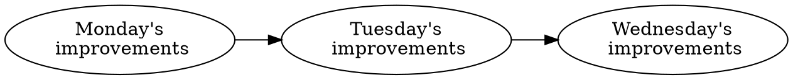
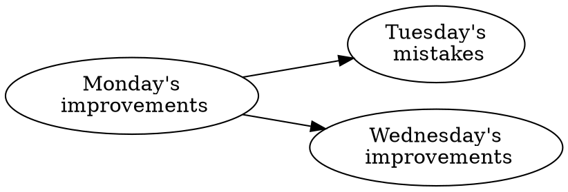
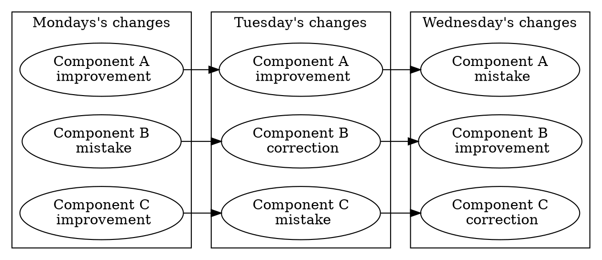

Introduction to Git --- Fall 2020
# Lecture 1: Why use version control?

<!-- .slide: data-background="#ffffff" -->

    

<small>Slides: https://hackmd.io/@hpc2n-git-2020/L1-motivation</small>

---

## What is version control?

---

 In software engineering, version control (also known as revision control, source control, or source code management) is a class of systems responsible for __managing changes__ to computer programs, documents, large web sites, or other collections of information.
--- Wikipedia

---

### Version control systems (VCS)

... systems responsible for **managing changes** ...

---

## Why use version control?

---

In an ideal world, things develop linearly: 
 - Every new version is an improvement upon the previous version. <!-- .element: class="fragment" data-fragment-index="1" -->
     - No need to backtrack. <!-- .element: class="fragment" -->
 - Everyone known what everyone else is doing <!-- .element: class="fragment" -->
 - In the end, things are simply finished. <!-- .element: class="fragment" -->

<!-- .element: class="fragment" data-fragment-index="1" -->

---

In real world, things develop non-linearly: 
 - A new version can anything between <!-- .element: class="fragment" data-fragment-index="1" -->
     - a complete catastrophe and 
     - a major breakthrough.
 - People do not know what others are doing <!-- .element: class="fragment" data-fragment-index="2" -->
 - Sometimes we are simply fixing earlier mistakes... <!-- .element: class="fragment" data-fragment-index="3" -->

<!-- .element: class="fragment" data-fragment-index="3" -->

---

### Going back to an earlier version

Sometimes, it is easier to simply backtrack to an *earlier version*...

---

#### Where is this *earlier version*?

 - CTRL + Z <!-- .element: class="fragment" -->
 - my_file.txt, my_file.txt.old, ... <!-- .element: class="fragment" -->
 - My project/ <!-- .element: class="fragment" -->
     - 2020-08-12/
     - 2020-08-13/
     - ...
 - Daily home directory backup <!-- .element: class="fragment" -->

---

#### Challenges and obstacles

 - Prone to mistakes <!-- .element: class="fragment" -->
     - CTRL + Z has limits, overwritten/deleted files, human/hardware error <!-- .element: class="fragment" -->
 - How much to save? <!-- .element: class="fragment" -->
     - Individual files? Everything? How much space is required? <!-- .element: class="fragment" -->
 - How to organize versions? <!-- .element: class="fragment" -->
     - What is the difference between different versions? <!-- .element: class="fragment" -->

*Overall, difficult to manage!* <!-- .element: class="fragment" -->

---

#### What about the granularity?

*This compounds the problems!*

---

#### How does VCS solve this?

 - Stores the history using snapshots (commits) <!-- .element: class="fragment" -->
     - Each snapshot represents the project in a given point of time <!-- .element: class="fragment" -->
 - Manages snapshots and associated metadata <!-- .element: class="fragment" -->
     - Naming (tags), comments, dates, authors, etc <!-- .element: class="fragment" -->
 - Easy to move between different snapshots <!-- .element: class="fragment" -->
 - Can handle different degrees of granularity <!-- .element: class="fragment" -->
 - Can handle multiple development paths (branches) <!-- .element: class="fragment" -->

---

### Comparing and joining

 - VCS makes it easy to compare different snapshots <!-- .element: class="fragment" -->
     - Named revisions, comments, time information, author information <!-- .element: class="fragment" -->
     - Diff tools <!-- .element: class="fragment" -->
     - Search tools <!-- .element: class="fragment" -->
     - Bisection search <!-- .element: class="fragment" -->
 - VCS also allows the joining (merging) of different snapshots  <!-- .element: class="fragment" -->
     - Easy to experiment with ideas <!-- .element: class="fragment" -->

---

### Collaboration

 - One of the primary functions of VCS is to allow collaboration <!-- .element: class="fragment" -->
 - Usual setup: server (remote) + multiple clients <!-- .element: class="fragment" -->
     - People work locally and send (push) the changes to the server <!-- .element: class="fragment" -->
     - VCS keeps track of what has been done and by whom <!-- .element: class="fragment" -->
 - Safer since mistakes can be easily remedied <!-- .element: class="fragment" -->
 - The contributions of several people can be merged <!-- .element: class="fragment" -->

---

### Backup

 - VCS functions as an backup <!-- .element: class="fragment" -->
 - Locally, the system maintains a copy of each file <!-- .element: class="fragment" -->
     - Usually only the changes or the files that have changed are stored <!-- .element: class="fragment" -->
 - Globally, lost files can be recovered from the server <!-- .element: class="fragment" -->

---

### Integration

 - VCSs such as Git have been integrated with several services <!-- .element: class="fragment" -->
     - HackMD, Overleaf, ...
 - Services such as GitHub can do almost everything for you <!-- .element: class="fragment" -->
     - Store history, distribute, testing / continuous integration, bug reports, milestones, website, ... <!-- .element: class="fragment" -->

---

## Practical use cases

What are the practical use cases for VCS?

---

### Source code

 - Many VCSs are designed for managing source code <!-- .element: class="fragment" -->
 - Manage deployment (production, development, testing, etc) <!-- .element: class="fragment" -->
 - Manage published versions (v0.1 etc) <!-- .element: class="fragment" -->
 - Manage (experimental) features <!-- .element: class="fragment" -->
 - Bug hunting <!-- .element: class="fragment" -->

---

### Latex files

 - Track which version of a manuscript has been <!-- .element: class="fragment" -->
     - submitted, 
     - revised and/or 
     - accepted
 - Collaboration between several authors <!-- .element: class="fragment" -->

---

### HPC: batch files and data

 - Track different version of your batch scripts <!-- .element: class="fragment" -->
     - Easy to check the used configuration afterwords
 - Track input and output files <!-- .element: class="fragment" -->
     - Limited to smallish files

---
