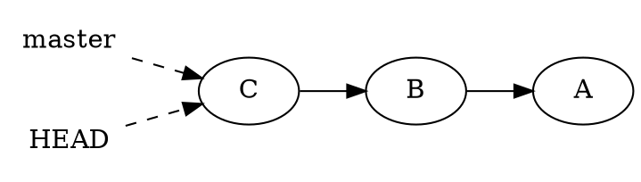
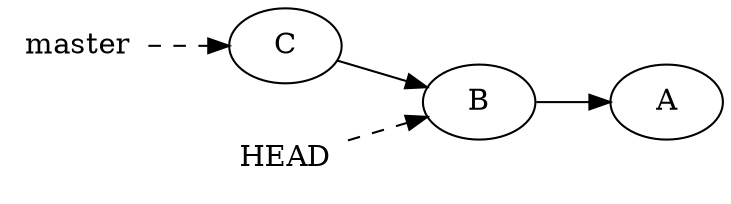
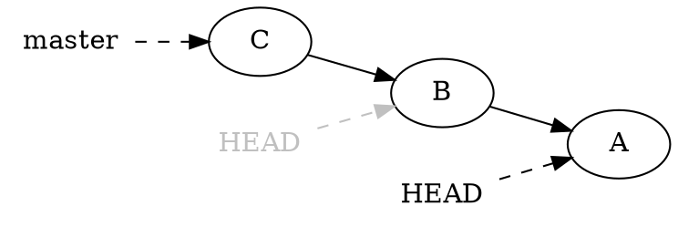
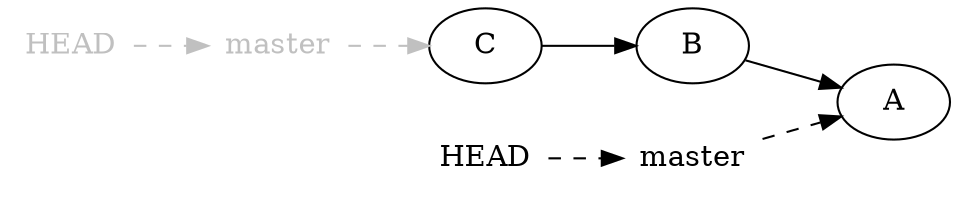
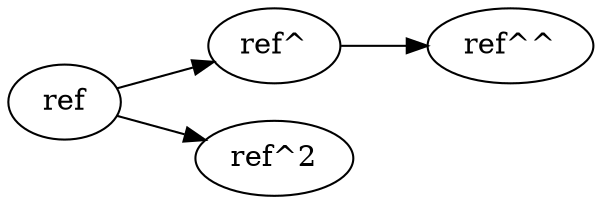
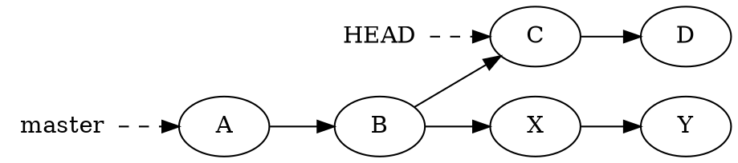
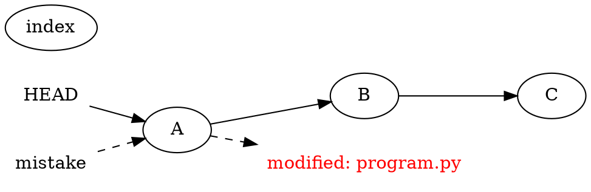
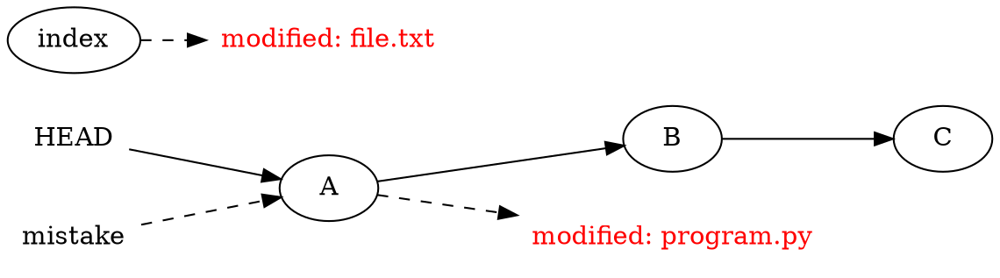
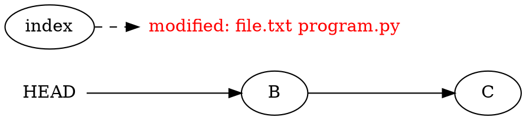
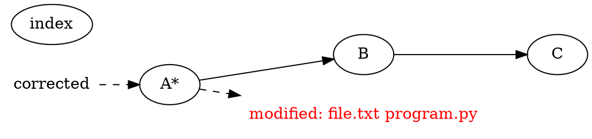

Introduction to Git --- Fall 2021
# Lecture 4: Commits

<!-- .slide: data-background="#ffffff" -->

<!-- Lecture material made by Mirko Myllykoski for the version of the course that was given in fall 2020. Lecture was first given by Mirko Myllykoski in fall 2020.-->

    

<small>Slides: https://hackmd.io/@hpc2n-git-2021/L4-commits#/</small>

---

## Investigating history

---

The **history** can be investigated with the `git log` command:

```shell
$ git log
commit 845aa0185080a80fa7ef3c.... (HEAD -> master)
Author: Mirko Myllykoski <mirkom@cs.umu.se>
Date:   Wed Sep 2 14:32:28 2020 +0200

    This is the most recent commit

commit d9290ba6afc2f7d62b981c....
Author: Mirko Myllykoski <mirkom@cs.umu.se>
Date:   Wed Sep 2 12:06:07 2020 +0200

    This is the second most recent commit

commit ....
```

---

 - Actually, `git log <ref>` lists commits that are **reachable** from `<ref>`
     - The command defaults to `HEAD`
 - For example:

```shell
$ git log d9290ba6af
commit d9290ba6afc2f7d62b981c3befaaeeedae4da720
Author: Mirko Myllykoski <mirkom@cs.umu.se>
Date:   Wed Sep 2 12:06:07 2020 +0200

    This is the second most recent commit

commit 17567d3b8023912978b8e39754ba612546312f90
Author: Mirko Myllykoski <mirkom@cs.umu.se>
Date:   Tue Aug 25 09:55:17 2020 +0200

    This is the third most recent commit
```

---

 - `git log -n <n> <ref> ` list only `<n>` most recent commits
 - `git log --oneline <ref> ` list only the shortened hash and the commit message:

```shell
$ git log --oneline
845aa01 (HEAD -> master) This is the most recent
d9290ba This is the second most recent commit
17567d3 is the third most recent commit
....
```

 - `git log --format=oneline <ref>`
     - The formats include, but are not limited to, `oneline`, `short`, `medium`, `full`, `fuller`, `email`, and `raw`

---

 - `git log --grep=<regexp> <ref>` displays commits that match a regular expression `<regexp>`:

```shell
$ git log --grep="bug"
commit be88ff1bb6396bdca28e84dcba6bb639d0c9f82a
Author: Mirko Myllykoski <mirkom@cs.umu.se>
Date:   Fri Jul 17 14:17:14 2020 +0200

    Fix a bug that caused my Saturday headaches 
```

---

 - `git log --{after,before} <date> <ref>` displays changes committed  after/before `<date>`:

```shell
$ git log --after="The end of May" --before="June 15th"
commit 50ea2854c6bf6aeb2e6683c8d505ad731f2960e2
Author: Mirko Myllykoski <mirkom@cs.umu.se>
Date:   Thu Jun 11 13:09:28 2020 +0200

...

commit add51b56dd0a985b8625e77e8b2b4dbfab2133b8
Author: Mirko Myllykoski <mirkom@cs.umu.se>
Date:   Wed Jun 3 12:08:56 2020 +0200
```

---

 - `git log --name-status <ref>` display files that were changed:

```shell
$ git log --name-status
commit 845aa0185080a80fa7ef3c.... (HEAD -> master)
Author: Mirko Myllykoski <mirkom@cs.umu.se>
Date:   Wed Sep 2 14:32:28 2020 +0200

    This is the most recent commit

M       file.txt
D       mistake.txt
```

 - `git log --stat <ref>` displays more information
 - `git log -p <ref>` displays even more information (diffs)

---

 - When working with multible branches, 
     - `--graph` visualizes the commit tree and 
     - `--all` displays all branches:

```shell
$ git log --graph --all --oneline
*   f0d7298 (HEAD -> master) Merge branch 'second_branch'
|\  
| * a118ae8 (second_branch) This is the third commit
* | d3c6c63 This is the second commit
|/  
* 23b3ed5 (tag: first) This is the first commit
```

---

### Reflog

 - The `git log` command displays **only changes that effect the commit tree**
 - Git stores extra logging information to a **reference log** (reflog)
     - Gets updated when the tips of branches and other references are modified
     - Accessed with the `git reflog` command
     - Some of the information can be merged with a regular log (`git log -g <ref>`)

---

 - Let's create and discard a commit (more on this later):

```shell
$ echo "More content to this file" >> file.txt 
$ git commit -a -m "I am going to delete this"
[master 2f529ae] I am going to delete this
 1 file changed, 1 insertion(+), 1 deletion(-)
```

```shell
$ git log --oneline
2f529ae (HEAD -> master) I am going to delete this
23b3ed5 This is the first commit
```

```shell
$ git reset --hard HEAD~
HEAD is now at 23b3ed5 This is the first commit
```

 - Note how the commit disappears from the log:

```shell
$ git log --oneline
23b3ed5 (HEAD -> master) This is the first commit
```

---

 - However, the commit (`2f529ae`) still exists in the reference log:

``` shell
$ git reflog
23b3ed5 (HEAD -> master) HEAD@{0}: reset: moving to HEAD~
2f529ae HEAD@{1}: commit: I am going to delete this
23b3ed5 (HEAD -> master) HEAD@{2}: commit (initial): This is
the first commit
```

 - At this point, we could attempt to recover the commit.
     - Note that Git is allowed to delete any orphan commits.

---

## Comparing commits

---

We can compare commits with `git diff`:

```shell
$ git log --oneline --graph --all
*   f0d7298 (HEAD -> master) Merge branch 'second_branch'
|\  
| * a118ae8 (second_branch) This is the third commit
* | d3c6c63 This is the second commit
|/  
* 23b3ed5 (tag: first) This is the first commit
```

```shell
$ git diff 23b3ed5 d3c6c63
diff --git a/file.txt b/file.txt
index 09c78e6..3b23ff0 100644
--- a/file.txt
+++ b/file.txt
@@ -1 +1,2 @@
 This file is very interesting
+More content
```

---

 - We can also investigate an individual file:

```shell
$ git diff 23b3ed5 d3c6c63 -- file.txt
diff --git a/file.txt b/file.txt
index 09c78e6..3b23ff0 100644
--- a/file.txt
+++ b/file.txt
@@ -1 +1,2 @@
 This file is very interesting
+More content
```

---

 - We can list all **uncommited** changes by comparing against `HEAD`:

```shell
$ git diff HEAD
```

 - We can list all **unstaged** changes with command:

```shell
$ git diff
```

 - We can list all **staged** changes with command:

```shell
$ git diff --cached
```

---

## Navigating the commit tree

---

 - In order to use the commits stored by Git, we must be able to navigate the commit tree
 - This happens with the `git checkout` and `git reset` commands
 - The commands behave slightly differently!

---

 - Let's investigate the commit tree. We are currently at `master`:

```shell
$ git log --graph --oneline
*   f0d7298 (HEAD -> master) Merge branch 'second_branch'
|\  
| * a118ae8 (second_branch) This is the third commit
* | d3c6c63 This is the second commit
|/  
* 23b3ed5 (tag: first) This is the first commit
```

 - We use `git checkout` to move to `d3c6c63`:

```shell
$ git checkout d3c6c63
....

HEAD is now at d3c6c63 This is the second commit
$ git log --graph --oneline
* d3c6c63 (HEAD) This is the second commit
* 23b3ed5 (tag: first) This is the first commit
```

---

 - `git checkout` **moves only the `HEAD`**, the tip of the branch is not modified:

```shell
$ git log --graph --oneline master
*   f0d7298 (master) Merge branch 'second_branch'
|\  
| * a118ae8 (second_branch) This is the third commit
* | d3c6c63 (HEAD) This is the second commit
|/  
* 23b3ed5 (tag: first) This is the first commit
```

 - `git checkout` attempts to keep local modifications to the files in the working tree

---

### Detached `HEAD`

If we `git checkout` on the tip of a branch...



Then we will get the following warning:

```shell
$ git checkout d3c6c63
 Note: switching to 'd3c6c63'.

You are in 'detached HEAD' state. You can look around, make
experimental changes and commit them, and you can discard any
commits you make in this state without impacting any branches
by switching back to a branch.

....
```

---

 - This simply means that the `HEAD` no longer points to the tip of the branch:



 - This **changes the behaviour of certain commands**.
 - We can disable the warning:

```shell
$ git config --global advice.detachedHead false
```

---

 - If we are currently on the tip of a branch, then:

```shell
$ git log -n 1 --oneline
f0d7298 (HEAD -> master) Merge branch 'second_branch'
$ git rev-parse --abbrev-ref HEAD
master
$ cat .git/HEAD 
ref: refs/heads/master
```

 - If we are in the detached `HEAD` mode, then:

```shell
$ git log -n 1 --oneline
d3c6c63 (HEAD) This is the second commit
$ git rev-parse --abbrev-ref HEAD
HEAD
$ cat .git/HEAD 
d3c6c635fb44c7084797d47050bff7961853c19b
```

---

 - The tip of the branch can be **recovered** with `git checkout <tip_ref>`:

```shell
$ git checkout master
Previous HEAD position was 23b3ed5 This is the first commit
Switched to branch 'master'
```

---

### Git reset

 - We could have also used `git reset` to move the `HEAD`:

```shell
$ git reset <option> <ref>
```

 - The option defines what gets updated / cleared:

|`<option>`| Tree | Index | HEAD | Comment        |
|----------|:----:|:-----:|:----:|----------------|
|`--soft`  |      |       |  X   |                |
|`--mixed` |      |   X   |  X   | Default        |
|`--hard`  |  X   |   X   |  X   |                |


---

 - The command can be **dangerous**!
 - If you are in the detached `HEAD` mode, then only the `HEAD` gets moved:



- Otherwise, also the **branch tip gets moved**:



---

 - Applying `git checkout` to a file **discards all changes** made to the file:

```shell
$ git checkout <filename>
```

 - Applying `git reset` to a file **unstages the file**:

```shell
$ git reset <filename>
```

---

An example:

```shell
$ echo "Even more content" >> file.txt
$ git add file.txt
$ git diff --cached
....
+Even more content
```

```shell
$ git reset file.txt
$ git diff --cached
$ git diff 
....
+Even more content
```

```shell
$ git checkout file.txt
Updated 1 path from the index
$ git diff
$
```

---

## Tagging

---

 - We can give a commit a special name (tag).
 - All existing tags can be listed with:

```shell
$ git tag
v0.1.0
v0.1.1
....
```

 - We can also search for a tag that matches a given string:

```shell
$ git tag -l "*beta*"
v0.1-beta.1
v0.1-beta.2
....
```

---

 - In the simplest case, we can create a **lightweight** tag:

```shell
$ git tag <tag_name>
```

 - The created tag always points to the current `HEAD`.
 - You an also create an **annotated** tag:

```shell
$ git tag -a <tag_name> -m <comment>
```

 - An annotated tag stores extra information such as the tag's creator, the creation time and a comment.

---

## Naming commits

---

 - We can refer to commits in many different ways:
     - Hash (commit id): d3c6c635fb44c7....
     - References, branches, tags: `HEAD`, `master`, `first`, etc
     - Long names: `refs/heads/master`, `refs/tags/first`

---

We can also refer to the ancestors of a commit:

```shell
$ git log --graph --all --oneline
*   f0d7298 (HEAD -> master) Merge branch 'second_branch'
|\  
| * a118ae8 (second_branch) This is the third commit
* | d3c6c63 This is the second commit
|/  
* 23b3ed5 (tag: first) This is the first commit
```

```shell
$ git rev-parse --short HEAD
f0d7298
```

```shell
$ git rev-parse --short HEAD~
d3c6c63
```

```shell
$ git rev-parse --short HEAD~~
23b3ed5
```

---

 - `ref~n` returns the `n`'th ancestor of `ref`.
     - `ref = ref~0`
     - `ref~ = ref~1`
     - `ref~~ = ref~2`
     - ...
 - Always follows the **first** parent

---

We can also refer to the parents of a commit:

```shell
$ git log --graph --all --oneline
*   f0d7298 (HEAD -> master) Merge branch 'second_branch'
|\  
| * a118ae8 (second_branch) This is the third commit
* | d3c6c63 This is the second commit
|/  
* 23b3ed5 (tag: first) This is the first commit
```

```shell
$ git rev-parse --short HEAD^1
d3c6c63
```

```shell
$ git rev-parse --short HEAD^2
a118ae8
```

---

 - `ref^n` returns the `n`'th parent of `ref`.
     - `ref = ref^0`
     - `ref^ = ref^1`
     - `ref^ = ref~`
 - Note that `ref^^ != ref^2`:



---

## Cleaning the working tree

---

 - Files that are already staged are cleaned with

```shell
$ git reset <option>
```

 - This is the same as `git reset <option> HEAD`

|`<option>`| Tree | Index | HEAD | Comment        |
|----------|:----:|:-----:|:----:|----------------|
|`--soft`  |      |       |  X   | Cleans nothing |
|`--mixed` |      |   X   |  X   | Default        |
|`--hard`  |  X   |   X   |  X   |                |

---

Unstaged files are cleared with

```shell
$ git clean <options> <path>
```

|    Option   | Description                  |
|-------------|------------------------------|
| `--dry-run` | nothing is cleaned           |
| `-d`        | clean more files recursively |
| `-i`        | clean interactively          |
| `-f`        | needed if `-i` is not given  |
| `-x`        | clean also ignored files     |
| `-X`        | clean only ignored files     |

---

 - Usually we first check what is going to be cleaned:

```shell
$ git clean --dry-run -dfx
```

 - If everything looks good, we will clean the files:

```shell
$ git clean -dfx
```

---

## Stashing changes

---

 - We sometimes find ourselves in a situation where we want to temporarily store the changes to the working tree.
 - This might happen, for example, when we are attempting to move the `HEAD`.
     - Git cannot always restore the working tree.
 - We can store these changes to the **stash**.

---

 - Let's try to move the `HEAD` to `1cb12030`:

```shell
$ git checkout 1cb12030
error: Your local changes to the following files would be 
overwritten by checkout:
        README.md
Please commit your changes or stash them before you switch
branches.
Aborting
```

 - We can simply stash the changes after which the checkout is successful:

```shell
$ git stash
Saved working directory and index state WIP on master:
845aa01 Test: Use STARNEIG_USE_ALL
```

```shell
$ git checkout 1cb12030
....
HEAD is now at 1cb1203 Use LANGUAGES argument in project
```

---

 - We can display the content of the entire stash:

```shell
$ git stash list
stash@{0}: WIP on master: 845aa01 Test: Use STARNEIG_USE_ALL
stash@{1}: WIP on devel: 1a34e4a Fix pkg-config file
stash@{2}: WIP on gh-pages: 1d8aab9 Add figures
stash@{3}: WIP on v0.1-devel: 70d21d8 Add shift_origin
parameter
```

 - The entries are numbered. Each row contains:
     - the stash id,
     - the name of the corresponding branch,
     - the commit hash, and
     - the matching commit message.

---

 - We can also display the content of an individual stash entry:

```shell
$ git stash show 0
 README.md | 2 +-
 1 file changed, 1 insertion(+), 1 deletion(-)
```

```shell
$ git stash show -p 0
diff --git a/README.md b/README.md
index 942e9f4..8dbf1f6 100644
--- a/README.md
+++ b/README.md
@@ -1,4 +1,4 @@
-# Introduction
+# Introduction to the software

....
```

---

 - We can **pop** the previous entry from the stash and apply it to the working tree:

```shell
$ git stash pop
On branch master
Your branch is up to date with 'origin/master'.

Changes not staged for commit:
  (use "git add <file>..." to update what will be committed)
  (use "git restore <file>..." to discard changes in working
  directory)
        modified:   README.md

no changes added to commit (use "git add" and/or
"git commit -a")
Dropped refs/stash@{0} (a3dd9b60b18c2....)
```

 - The stashed changes are applied to the working tree and the entry is dropped

---

 - We can also apply any entry from the stash (does not drop the entry):

```shell
$ git stash apply <stash_id>
```

 - `git stash` stashes files that are **already added to the index**. 
     - This behaviour can be overwritten with the `--keep-index` option. 

---

#### Multiple commits from a single set of edits

 - Imagine the following situation: *You have spent 3 days coding and are finally ready to commit your changes. You wish to divide the changes into several self-contained commits.*
 - Each commit should both compile and function correctly
 - How would you do this?

---

 - Do the following for each commit you want to create:
     1. Stage changes that should go to the commit.
     2. Stash unstaged changes but keep the index (`--keep-index`).
     3. Compile and test your code.
         4a. If your code functions as intended, commit, pop stash and move to the next commit. 
         4b. Otherwise, pop the stash and continue from step #1.

---

## Making changes to the commit tree

---

### Remark

The following techniques should be used with caution!

It is generally a **bad idea** to modify the commit tree if the changes have been pushed to a remote.

We will return to this during Lecture 6.

---

### Reminder

`HEAD` determines the branch you are on:



---

 - If you are in the detached `HEAD` mode, then `git reset` moves only the `HEAD`:


- Otherwise, also the **branch tip gets moved**:


---

### Discarding the last commit

 - If we are not in the detached `HEAD` mode, then we can **discard the latest commit** with the `git reset` command:

```shell
$ git reset HEAD~
Unstaged changes after reset:
M       file.txt
```

 - `git reset` defaults to `git reset --mixed` => the **state of the working tree is kept**.

---

 - If we are lucky, we can still recover the commit:

```shell
$ git reset f0d7298983
```

 - We can try again and also **discard the working tree**:

```shell
$ git reset --hard HEAD~
HEAD is now at d3c6c63 This is the second commit
```

---

### Changing the last commit

Imagine a situation where you have just committed your changes and then realized that you have made a *mistake*.



Forgotten file, incorrect commit message, etc

---

The problem can be fixed easily in two steps: Step #1 is to stage the forgotten changes:

```shell
$ git add file.txt
$ git status
On branch master
Changes to be committed:
  (use "git restore --staged <file>..." to unstage)
        modified:   file.txt
```



---

 - Step #2 is to replace the current `HEAD` with a corrected commit:

```shell
$ git commit --amend
```

 - The command behaves the same ways as regular `git commit` call.

---

 - The **amend** command first removes the HEAD commit from the commit tree and combines it with the current index:



 - Equivalent to `git reset --soft HEAD^`:

```shell
$ git reset --soft HEAD^
$ git status
On branch master
Changes to be committed:
  (use "git restore --staged <file>..." to unstage)
        modified:   file.txt
        modified:   program.py
```

---

 - The command then creates a new commit from the *combined* index:



 - Which is equivalent to
```shell
$ git commit -c ORIG_HEAD
[master #######] B
 Date: ### ### ## ##:##:## #### #####
 2 files changed, 2 insertions(+)
```

---

## Reverting a commit

---

 - It is sometimes more convenient to simply **revert** a commit.
 - This means that a special commit is created that **undoes** the changes included in a different commit.
 - The commit tree **is not modified**.
     - Does not effect other people.

---

We are first going to create a commit that replaces the content of a file:

```shell
$ echo "This file is not that interesting" > file.txt
$ git commit -a -m "Bad commit"
[master 465a5a4] Bad commit
 1 file changed, 1 insertion(+), 3 deletions(-)
```

```shell
$ git log --oneline --graph --all
* 465a5a4 (HEAD -> master) Bad commit
*   f0d7298 Merge branch 'second_branch'
|\  
| * a118ae8 (second_branch) This is the third commit
* | d3c6c63 This is the second commit
|/  
* 23b3ed5 (tag: first) This is the first commit
```

---

We later discover that the commit was a mistake and revert it:

```shell
$ git revert 465a5a4
[master 173e959] Revert "Bad commit"
 1 file changed, 3 insertions(+), 1 deletion(-)
```

```shell
$ git log --oneline --graph --all
* 173e959 (HEAD -> master) Revert "Bad commit"
* 465a5a4 Bad commit
*   f0d7298 Merge branch 'second_branch'
|\  
| * a118ae8 (second_branch) This is the third commit
* | d3c6c63 This is the second commit
|/  
* 23b3ed5 (tag: first) This is the first commit
```

---

We can see that the revert commit simply removes the changes made in the first commit and restores changes make in the preceding commit:

```shell
$ git show 173e959
commit 173e959ed5b0ccd9.... (HEAD -> master)
Author: Mirko Myllykoski <mirko.myllykoski@gmail.com>
Date:   Tue Sep 29 19:56:19 2020 +0200

    Revert "Bad commit"
    
    This reverts commit 173e959ed5b0ccd9.....
....
-This file is not that interesting
+This file is very interesting
+More content
+Different content
```

---

## Exercises

---

|    Exercise    | Description                            |
|----------------|----------------------------------------|
| 1.log          | Learn how to use `git log`             |
| 2.recover_head | Learn how to recover a detached `HEAD` |
| 3.stash        | Learn how to use `git stash`           |
| 4.discard      | Learn how to discard commits           |
| 5.amend        | Learn how to amend commits             |
| 6.revert       | Learn how to revert commits            |
| 7.workflow     | Learn proper workflow                  |
