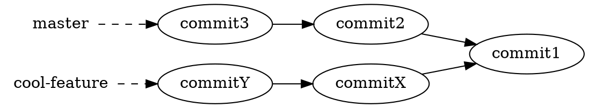
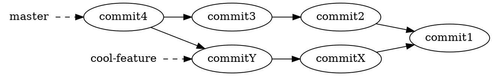
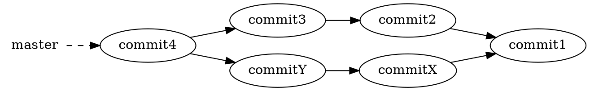
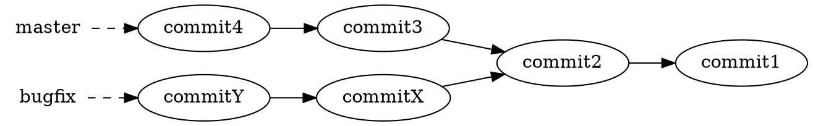
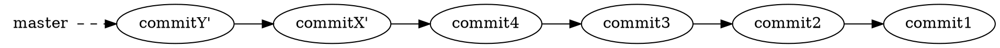
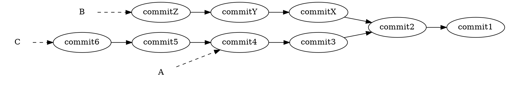
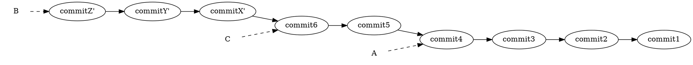
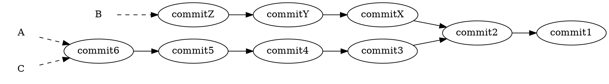

Introduction to Git --- Fall 2021
# Lecture 5: Branches

<!-- .slide: data-background="#ffffff" -->

<!-- Lecture material made by Birgitte Brydsö for the version of the course that was given in fall 2020. Lecture was first given by Birgitte Brydsö in fall 2020. 
Minor modifications done for the fall 2021 version of the course. -->

    

<small>Slides: https://hackmd.io/@hpc2n-git-2021/L5-branches#/</small>

---

## What is a Git branch?

<!-- .slide: style="font-size: 30px;" -->

<style type="text/css">
  .reveal p {
    text-align: left;
  }
  .reveal ul {
    display: block;
  }
  .reveal ol {
    display: block;
  }
</style>

* A pointer to a commit (ref: named pointer)
* Defined as all points reachable in the commit graph from the named commit (the "tip" of the branch)
* The ref HEAD determines what branch you are on. 
* If HEAD is a symbolic ref for an existing branch, then you are “on” that branch. 
* If HEAD is a simple ref directly naming a commit by its SHA-1 ID, you are  not “on” any branch - you are in “detached HEAD” mode, which happens when you check  out some earlier commit to examine. 

---

## Why use branches?

<!-- .slide: style="font-size: 32px;" -->
<!-- .slide: class="fragment" -->

There are many uses for branches: 

- We want to develop new features, but not risk changing the working main code yet <!-- .element: class="fragment" -->
- Test different directions for a project <!-- .element: class="fragment" -->
- Several projects members would like to work on their own copy of the code <!-- .element: class="fragment" -->
- Bug fixes that are not yet tested, but will later be merged into the main version <!-- .element: class="fragment" -->

---

## What is a Git branch?

<!-- .slide: style="font-size: 30px;" -->

Until now, we have worked with a repository that only have one branch, with the commits done one at a time: 


In the above picture, the master branch points to a commit. The current position is HEAD. 

---

## What is a Git branch - basic concepts

<!-- .slide: style="font-size: 30px;" -->

Now we want to look at repositories with several branches: 


Branches are used to create another line of development.  They are "individual projects" within a git repository. 

---

<!-- .slide: style="font-size: 32px;" -->

* The branch is the commit and all its parent commits, not just the one we are currently pointing at. 
* The main line of development is usually called the "master" branch.<!-- .element: class="fragment" -->
* Different branches within a repository can have<!-- .element: class="fragment" -->
  * completely different files and folders
  * almost everything the same except for a few lines of code in a file

---

<!-- .slide: style="font-size: 32px;" -->

Usually, a branch is created to work on a new feature. Once the feature is completed, it is merged back with the master branch.


---

## Branches: Creation

<!-- .slide: style="font-size: 36px;" -->

Creating a new branch does not change the repository, it just points out the commit. 

Note that the branch is created from the current HEAD.
<!-- .element: class="fragment" -->
To create a new branch (called cool-feature in the following): 
<!-- .element: class="fragment" -->
```shell
$ git branch cool-feature
```
<!-- .element: class="fragment" -->

---

<!-- .slide: style="font-size: 36px;" -->

To move to another branch (switch): 

```shell
$ git checkout cool-feature
```

If you wish to switch to a new branch that is not yet created, you can do so by adding the flag `-b` to `git checkout`.
<!-- .element: class="fragment" -->
To see which branch you are on:
<!-- .element: class="fragment" -->
```shell
$ git branch
```
<!-- .element: class="fragment" -->

---

## Branches: merging, deletion

<!-- .slide: style="font-size: 30px;" -->

- When you have decided you are happy with the changes you made to the new branch, merge it back to the master branch (or another branch)
- Note: The branch is always merged to the current HEAD. <!-- .element: class="fragment" -->
- First switch to the branch you are merging it to: <!-- .element: class="fragment" -->
```shell
$ git checkout master
```
<!-- .element: class="fragment" -->
- Then merge them: <!-- .element: class="fragment" -->
```shell
$ git merge cool-feature
```
<!-- .element: class="fragment" -->
- You can now delete the extra branch: <!-- .element: class="fragment" -->
```shell
$ git branch -d cool-feature
```
<!-- .element: class="fragment" -->

---

## Example 

<!-- .slide: style="font-size: 32px;" -->

* Create a directory. Initialize a repository
* Create a file, stage it, and commit it <!-- .element: class="fragment" -->

```shell
$ mkdir my-project; cd my-project/
$ git init
Initialized empty Git repository in /home/bbrydsoe/my-project/.git/
$ touch file.txt
$ git add file.txt 
$ git commit -m "Committing the first file"
[master (root-commit) 1006b51] Committing the first file
 1 file changed, 0 insertions(+), 0 deletions(-)
 create mode 100644 file.txt
```
<!-- .element: class="fragment" -->

---

<!-- .slide: style="font-size: 32px;" -->

* Create a new branch, then switch to that branch
* Make some changes - add files and text <!-- .element: class="fragment" -->
* Stage the file and commit it <!-- .element: class="fragment" -->
```shell
$ git branch cool-feature
$ git checkout cool-feature 
Switched to branch 'cool-feature'
$ echo "This is a text" > file.txt 
$ git add file.txt 
$ git commit -m "Added text to the first file" 
[cool-feature 5bad966] Added text to the first file
 1 file changed, 1 insertion(+)
```
<!-- .element: class="fragment" -->

---

<!-- .slide: style="font-size: 32px;" -->

- Switch back to the master branch, make some changes 
```shell
$ git checkout master
Switched to branch 'master'
$ echo "Text to the second file" > second-file.txt 
$ git add second-file.txt 
$ git commit -m "Added a second file"
[master bdec2cf] Added a second file
 1 file changed, 1 insertion(+)
 create mode 100644 second-file.txt
```
<!-- .element: class="fragment" -->
- We should check the effect of the changes. I will use this command: 
<!-- .element: class="fragment" -->
```shell
$ git log --graph --oneline --decorate --all
```
<!-- .element: class="fragment" -->

---

<!-- .slide: style="font-size: 32px;" -->

This is on the master branch 

```shell
$ git log --graph --oneline --decorate --all
* bdec2cf (HEAD -> master) Added a second file
| * 5bad966 (cool-feature) Added text to the first file
|/  
* 1006b51 Committing the first file
```
<!-- .element: class="fragment" -->
We now merge the branches and check again 
<!-- .element: class="fragment" -->
```shell
$ git merge cool-feature 
Merge made by the 'recursive' strategy.
 file.txt | 1 +
 1 file changed, 1 insertion(+)
$ git log --graph --oneline --decorate --all
*   cf3e6b7 (HEAD -> master) Merge branch 'cool-feature'
|\  
| * 5bad966 (cool-feature) Added text to the first file
* | bdec2cf Added a second file
|/ 
* 1006b51 Committing the first file
```
<!-- .element: class="fragment" -->

---

<!-- .slide: style="font-size: 36px;" -->

Now we can delete the new branch we had created, since all the content is now in the master branch. 

```shell
$ git branch -d cool-feature 
Deleted branch cool-feature (was 5bad966).
```

---

<!-- .slide: style="font-size: 26px;" -->

In a somewhat nicer format, it looks like this: 

We commit stuff to both branches


---

<!-- .slide: style="font-size: 26px;" -->

Merge 'cool-feature' to 'master'

Delete 'cool-feature'


---

## Switching with uncommitted changes

<!-- .slide: style="font-size: 26px;" -->

As mentioned above, you switch between branches with: 

```shell
$ git checkout <branch>
```
<!-- .element: class="fragment" -->
What happens if you have uncommitted changes (and/or new files added) when you try to switch?
<!-- .element: class="fragment" -->
- The uncommitted changes will be carried to the new branch that you switch to, if possible. 
<!-- .element: class="fragment" --> 
- Changes that you commit will be committed to the newly switched branch.
<!-- .element: class="fragment" -->
What if there is a conflict? <!-- .element: class="fragment" -->
- You will **not** be allowed to switch to the other branch. <!-- .element: class="fragment" -->
- You must commit or stash any conflicting changes before switching branches. <!-- .element: class="fragment" -->

---

## Example - new file

<!-- .slide: style="font-size: 30px;" -->

Here we create a new branch, switch to it, then add a new file. Then we switch back to the master branch without committing the changes: 

```shell
$ git checkout -b cool-feature 
Switched to a new branch 'cool-feature'
$ touch newfile.txt
$ git add newfile.txt 
$ git checkout master
A	newfile.txt
Switched to branch 'master'
```

Git warns that there is a file added in one branch but not the other, but the switch is allowed. 

---

## Example - modified file

<!-- .slide: style="font-size: 32px;" -->

If we make changes to the file in one of the branches but not on the other and do not commit it, then git will again warn: 

```shell
$ echo "Adding some text" >> newfile.txt
$ git add newfile.txt 
$ git checkout master
M	newfile.txt
Switched to branch 'master'
```

Git warns that there is a file that is modified in one branch but not the other, but the switch is allowed. 

---

## Example - uncommitted, conflicting changes

<!-- .slide: style="font-size: 32px;" -->

Assume two branches, "cool-feature" and "morefeatures"

Switch to branch "cool-feature", add some text to a file, stage the file and commit it: 

```shell
$ git checkout cool-feature 
Switched to branch 'cool-feature'
$ echo "add text" >> morefiles.txt 
$ git add morefiles.txt 
$ git commit -m "Some text"
[cool-feature 469542b] Some text
 1 file changed, 1 insertion(+)
 create mode 100644 morefiles.txt
```

---

<!-- .slide: style="font-size: 30px;" -->

Switch to branch "morefeatures". Modify the same file, stage the file and commit it. Then try and switch back to the "cool-features" branch: 

```shell
$ git checkout morefeatures 
Switched to branch 'morefeatures'
$ echo "Adding yet some more text" >> morefiles.txt
$ git add morefiles.txt 
$ git checkout cool-feature 
error: Your local changes to the following files would be overwritten by checkout:
	morefiles.txt
Please commit your changes or stash them before you switch branches.
Aborting
```
Now Git complains. 

---

## Handling uncommitted changes

<!-- .slide: style="font-size: 36px;" -->

So what can we do if there is a conflict?

* Commit the changes before switching branch <!-- .element: class="fragment" -->
* Stash the uncommitted changes <!-- .element: class="fragment" -->
* Discard the uncommitted changes <!-- .element: class="fragment" -->
* Checkout with Merge <!-- .element: class="fragment" -->

<!-- ## Handling uncommitted changes - stashing -->

<!-- .slide: style="font-size: 32px;" -->

<!-- The command "stash" can be described as a drawer where you store uncommitted changes temporarily. 

After stashing your uncommitted changes you can continue working on other things in a different branch.

The uncommitted changes that are stored in the stash can be taken out and applied to any branch, including the original branch. 

-->

---

## Stashing, example 

<!-- .slide: style="font-size: 32px;" -->

First do a `git status` in the branch where you may have uncommitted changes: 

```shell
$ git status
On branch morefeatures
Changes to be committed:
  (use "git reset HEAD <file>..." to unstage)

	modified:   file.txt
	new file:   morefiles.txt
```

You can see the dirty status. 

---

<!-- .slide: style="font-size: 32px;" -->

To fix it, let us use `git stash`:

```shell
$ git stash
Saved working directory and index state WIP on morefeatures: 4922606 Some text
```

Checking again with `git status`: 
<!-- .element: class="fragment" -->
```shell
$ git status
On branch morefeatures
nothing to commit, working tree clean
```
<!-- .element: class="fragment" -->
You can now switch branches and work on something else. 
<!-- .element: class="fragment" -->

---

<!--
## Working with stashes

You can have several stashes stored. To see them, use 

```
$ git stash list
```

Example: 

```
$ git stash list
stash@{0}: WIP on morefeatures: 4922606 Some text
stash@{1}: WIP on morefeatures: 4922606 Some text
stash@{2}: WIP on morefeatures: 4922606 Some text
```

--- 

## Working with stashes - continued

When you have done what you needed before committing the stashed changes you can reapply a stash, using 

```
$ git stash apply
```

which will apply the most recent stash. If you want to apply a different stash, you can name it.

Example: 

```
$ git stash apply stash@{0}
```
-->

## Discarding uncommitted changes 

<!-- .slide: style="font-size: 32px;" -->

If you do not want to stash your changes, but just get rid of them, you can use `git clean`.

WARNING: This command will remove all non-tracked files in your current directory!
<!-- .element: class="fragment" -->
You can safely test which files will be removed by running: 
<!-- .element: class="fragment" -->
```shell
$ git clean --dry-run
```
<!-- .element: class="fragment" -->

---

## Handling uncommitted changes - merging

<!-- .slide: style="font-size: 30px;" -->

- There is a checkout with merge option. Add the flag `--merge` (or `-m`): 
```shell
$ git checkout --merge <branch>
```
- This will perform a three-way merge between your working tree and the new branch, with the current branch as the base.
<!-- .element: class="fragment" -->
- After the merge, you will be on the new  branch and the merged result will be in your working tree. 
<!-- .element: class="fragment" --> 
- NOTE: As with any merge, conflicts may result and you will then have to resolve those. 
<!-- .element: class="fragment" -->

---

## Merging and merge conflicts

<!-- .slide: style="font-size: 32px;" -->

- Merge conflicts will happen now and then when you are working with more than one branch and try to merge them. 
- In many cases, Git is actually able to do a merge without problems. However, merge conflicts can happen. <!-- .element: class="fragment" -->
- If Git cannot safely merge something automatically, you will get a message like this: <!-- .element: class="fragment" -->
```shell
error: Entry '<fileName>' would be overwritten by merge. 
Cannot merge. (Changes in staging area)
```
<!-- .element: class="fragment" -->
- NOTE: Always check that you are on the right branch before merging! You check the branch with `git branch`.
<!-- .element: class="fragment" -->

---

<!-- .slide: style="font-size: 32px;" -->

Git can automatically try to merge when you give the command: 

```shell
$ git merge <branch-to-merge-to>
```

while standing on the branch you want to merge to. 

---

<!-- .slide: style="font-size: 32px;" -->

Git has some merge strategies. The most commonly used are: 

* Fast Forward Merge - the commit history is one straight line. You create a branch, you make some commits there, but no changes to the 'master'. You then just merge onto the 'master'. This just moves the pointer for the 'master' branch forward in a straight line. <!-- .element: class="fragment" -->
* Recursive Merge - make a branch and make some commits there, but also make new commits made on the ‘master‘. Then, when you want to merge, git will recurse over the branch and create a new merge commit. The merge commit will continue to have two parents. <!-- .element: class="fragment" -->

---

## Merge conflicts, example

<!-- .slide: style="font-size: 30px;" -->

Here we create a merge conflict:

```shell
$ mkdir merge-test
$ cd merge-test/
~/merge-test$ git init
Initialized empty Git repository in /home/bbrydsoe/merge-test/.git/
~/merge-test$ echo "Creating a file with some text to play with." >> myfile.txt
~/merge-test$ git add myfile.txt 
~/merge-test$ git commit -m "First commit"
[master (root-commit) 9badcc6] First commit
 1 file changed, 1 insertion(+)
 create mode 100644 myfile.txt
~/merge-test$ git checkout -b mergebranch
Switched to a new branch 'mergebranch'
~/merge-test$ echo "Adding text to the file in order to merge." > myfile.txt 
```

---

<!-- .slide: style="font-size: 32px;" -->

```shell
~/merge-test$ git add myfile.txt 
~/merge-test$ git commit -m "Changed the content of myfile.txt"
[mergebranch 41b0e36] Changed the content of myfile.txt
 1 file changed, 1 insertion(+), 1 deletion(-)
~/merge-test$ git checkout master
Switched to branch 'master'
~/merge-test$ echo "Put more text to the file" >> myfile.txt 
~/merge-test$ git add myfile.txt 
bbrydsoe@enterprise-a:~/merge-test$ git commit -m "Added more text"
[master c17e479] Added more text
 1 file changed, 1 insertion(+)
~/merge-test$ git merge mergebranch 
Auto-merging myfile.txt
CONFLICT (content): Merge conflict in myfile.txt
Automatic merge failed; fix conflicts and then commit the result.
```

So Git complains 

---

<!-- .slide: style="font-size: 32px;" -->

We can get some more information with the `git status` command: 

```shell
~/merge-test$ git status
On branch master
You have unmerged paths.
  (fix conflicts and run "git commit")
  (use "git merge --abort" to abort the merge)

Unmerged paths:
  (use "git add <file>..." to mark resolution)

	both modified:   myfile.txt

no changes added to commit (use "git add" and/or "git commit -a")
```

---

<!-- .slide: style="font-size: 32px;" -->

Looking inside the file myfile.txt: 

```shell
~/merge-test$ cat myfile.txt 
<<<<<<< HEAD
Creating a file with some text to play with.
Put more text to the file
=======
Adding text to the file in order to merge.
>>>>>>> mergebranch
```

Some "conflict dividers" have been added. 

---

## Resolving merge conflicts 

<!-- .slide: style="font-size: 28px;" -->

- The most direct way to resolve the conflict is editing the file yourself. 
- When this has been done, you can repeat the merge with: <!-- .element: class="fragment" -->
```shell
$ git merge --continue <branch-to-merge>
```
<!-- .element: class="fragment" -->
Commands to help: <!-- .element: class="fragment" -->
- To identify conflicting files: `git status` 
<!-- .element: class="fragment" -->
- To get a list of commits that conflict between the branches: `git log --merge` 
<!-- .element: class="fragment" -->
- Find differences between states of a repository/files: `git diff` 
<!-- .element: class="fragment" -->
- Reset conflicted files to a known good state: `git reset` 
<!-- .element: class="fragment" -->

If you made a mistake when you resolved a conflict and have completed the merge before realizing, you can roll back to the commit before the merge was done with the command `git reset --hard`. 
<!-- .element: class="fragment" -->

---

## Workflow - merge goes well

<!-- .slide: style="font-size: 32px;" -->

- Work on files <!-- .element: class="fragment" -->
- Stage files <!-- .element: class="fragment" -->
- Commit files <!-- .element: class="fragment" -->
- Then do <!-- .element: class="fragment" -->
```shell
$ git merge <other-branch>
``` 
<!-- .element: class="fragment" -->

Success! <!-- .element: class="fragment" -->

---

## Workflow - merge goes badly 

<!-- .slide: style="font-size: 30px;" -->

- Work on files <!-- .element: class="fragment" -->
- Stage files <!-- .element: class="fragment" -->
- Commit files <!-- .element: class="fragment" -->
- Then do <!-- .element: class="fragment" -->
```shell
$ git merge <other-branch>`
```
<!-- .element: class="fragment" -->
- CONFLICT! <!-- .element: class="fragment" -->
- Fix problems <!-- .element: class="fragment" -->
- Stage files <!-- .element: class="fragment" -->
- Commit files <!-- .element: class="fragment" -->
- Then do <!-- .element: class="fragment" -->
```shell
$ git merge --continue <other-branch>`
```
<!-- .element: class="fragment" -->
Success! <!-- .element: class="fragment" -->

---

## Rebasing

<!-- .slide: style="font-size: 32px;" -->

- Rebasing is the process of moving or combining a sequence of commits to a new base commit. 
- It solves the same problem as git merge. The commands are both used to integrate changes from one branch into another branch, however the way they do it is very different. <!-- .element: class="fragment" -->
- When you do a rebase, all the changes will be compressed together in a single "patch" which is then "applied" - rebasing creates new commits on the other branch for each commit in the original branch. <!-- .element: class="fragment" --> 

---

## Rebasing - illustration 

<!-- .slide: style="font-size: 26px;" -->

Branch 'bugfix' was branched from 'master' 

Rebasing 'bugfix' to the 'master' branch


---

## Rebasing - continued

<!-- .slide: style="font-size: 30px;" -->

Assume a master branch and the branch "cool-features" and that you want to rebase the branch "cool-features" onto the master branch: 

```shell
$ git checkout cool-features
$ git rebase master
```

This works by <!-- .element: class="fragment" -->

* going to the common ancestor of the two branches <!-- .element: class="fragment" -->
* getting the diff introduced by each commit of the branch you are on <!-- .element: class="fragment" -->
* saving those diffs to temporary files <!-- .element: class="fragment" -->
* resetting the current branch to the same commit as the branch you are rebasing onto <!-- .element: class="fragment" -->
* apply each change in turn <!-- .element: class="fragment" -->

---

## Rebasing vs. Fast-forward merge

<!-- .slide: style="font-size: 32px;" -->

Not the same! A rebase moves a branch from one base to another. A fast-forward merge moves a branch head from the current commit to a commit for a descendant. 

Example: <!-- .element: class="fragment" -->

Start <!-- .element: class="fragment" -->

<!-- .element: class="fragment" -->

---

<!-- .slide: style="font-size: 28px;" -->

Rebase B onto C


FF merge C into A:


---

## Cherry-picking 

<!-- .slide: style="font-size: 30px;" -->

Basically, cherry-picking in Git means that you choose a commit from one branch that you apply to another. 

Find the hash for the commit you want to apply, using `git log`. <!-- .element: class="fragment" -->

Then make sure you are on the right branch that you want to apply the commit to: 
<!-- .element: class="fragment" -->
```shell
$ git checkout <branch>
```
<!-- .element: class="fragment" -->
Now you execute the cherry-picking: 
<!-- .element: class="fragment" -->
```shell
$ git cherry-pick <hash>
```
<!-- .element: class="fragment" -->

---

## Exercises 

<!-- .slide: style="font-size: 26px;" -->

Each of the exercises has a README.md file with explanations and descriptions of what to do. You can find all of them in the subdirectory 5.branches. You should do them in the below order: 
 
1. Fast-forward Merge (OK): This exercise will show an example where git can do a fast-forward merge. The exercise is in the subdirectory "1.merge-ok" <!-- .element: class="fragment" -->
2. Recursive Merge (OK): In this exercise you will see an example where git can automatically merge two branches. This time git will use the recursive merge. The exercise can be found in the subdirectory "2.merge-ok-recursive" <!-- .element: class="fragment" -->
3. Merge (BAD): This exercise gives an example of a merge that cannot be done automatically with the merge command. The exercise can be found in the subdirectory "3.merge-bad" <!-- .element: class="fragment" -->
4. Rebasing (OK): In this exercise you will try the command rebase and see that it succeeds. The exercise can be found in the subdirectory "4.rebase-ok"  <!-- .element: class="fragment" -->
5. Rebasing (BAD): This exercise again gives an example of rebasing two branches, but in this case the rebase fails. The exercise can be found in the subdirectory "5.rebase-bad" <!-- .element: class="fragment" -->

