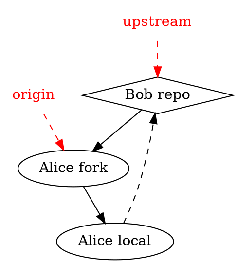
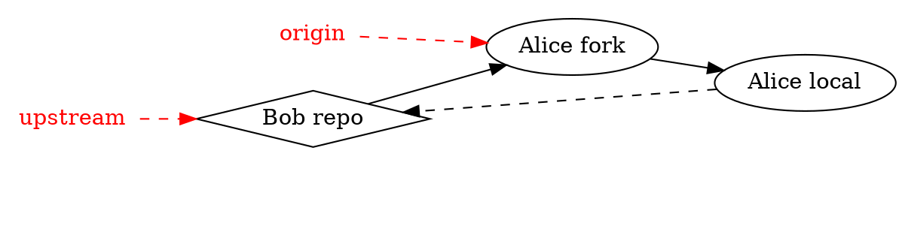

Introduction to Git --- Fall 2020
# Lecture 6: Working with remotes

<!-- .slide: data-background="#ffffff" -->

    

<small>Slides: https://hackmd.io/@hpc2n-git-2020/L6-remotes#/</small>


---

<!-- .slide: data-background="#ffffff" -->
<style type="text/css">
  .reveal p {
    text-align: left;
  }
  .reveal ul {
    display: block;
  }
  .reveal ol {
    display: block;
  }
</style>
## Basic concepts
A remote repository is a version of the project which can be hosted in your local machine, some network, or over the internet[1] where you and your collaborators can push or pull code modifications. 

In addition to this, a remote is a way to backup your repository.

---

<!-- .slide: data-background="#ffffff" -->


---

<!-- .slide: data-background="#ffffff" -->
## Basic concepts cont.
The command 

```shell
$ git remote -v
origin  git@bitbucket.org:arm2011/gitcourse.git (fetch)
origin  git@bitbucket.org:arm2011/gitcourse.git (push)
```


displays the remotes that are already set up where you can *fetch* and *pull* changes. In this case there is only a single remoted called **origin**.

[^1]: Pro Git, 2nd. Ed., Scott Chacon and Ben Straub.


---

<!-- .slide: data-background="#ffffff" -->
## Adding remotes

A remote repository can be added manually with the command

```console
$ git remote add remote_name location

$ git remote add origin https://github.com/aliceuser2020/my-first-project.git

$ git remote -v
origin	https://github.com/aliceuser2020/my-first-project.git (fetch)
origin	https://github.com/aliceuser2020/my-first-project.git (push)
```

where the location of the remote can be an URL or the path if that is in your local machine.


---

<!-- .slide: data-background="#ffffff" -->
Protocols:
- local ->  git clone /opt/git/project.git
- SSH   ->  git clone ssh://user@server:project.git
- HTTP  ->  git clone http://example.com/gitproject.git
- Git


---

<!-- .slide: data-background="#ffffff" -->

Why do we need more than one remote?




---


<!-- .slide: data-background="#ffffff" -->

```shell
$ git remote add upstream git@bitbucket.org:bob/gitcourse.git

$ git remote -v
origin	https://github.com/aliceuser2020/my-first-project.git (fetch)
origin	https://github.com/aliceuser2020/my-first-project.git (push)
upstream	https://github.com/bobuser2020/my-first-project.git (fetch)
upstream	https://github.com/bobuser2020/my-first-project.git (push)
```

---

<!-- .slide: data-background="#ffffff" -->
## Working with remotes
One can push or fetch/pull to or from remotes by

```shell
$ git push  remote_name branch_name
$ git fetch remote_name branch_name
$ git pull  remote_name branch_name 
```

---

<!-- .slide: data-background="#ffffff" -->
In case you obtained the repository by cloning an existing one you will have the **origin** remote. You can do push/fetch/pull for this remote with

```shell
$ git push  origin master      
$ git fetch origin master
$ git pull  origin master
```

---

<!-- .slide: data-background="#ffffff" -->
or 

```shell
$ git push
$ git fetch
$ git pull
```

because the remote *origin* and the *master* branch are configured for pushing and pulling by default upon cloning.

---

<!-- .slide: data-background="#ffffff" -->
The command: 
```shell
$ git pull
```
brings all the changes (branches) that are in the remote and tries to merge them with your local repo. The default behavior of *git pull* is in the *$GIT_DIR/config* file:
```shell
[remote "origin"]
  fetch = +refs/heads/*:refs/remotes/origin/*
```

---

<!-- .slide: data-background="#ffffff" -->
In fact, *git pull* is a combination of two commands:
```shell
$ git fetch 
$ git merge
```

The command
```shell
$ git push 
```
will send all the changes (branches) to the remote by default. This can be changed by applying:
```shell
git config --global push.default matching(default), current, ...
```


---

<!-- .slide: data-background="#ffffff" -->
### Displaying remote information

```console
$ git remote show origin
* remote origin
  Fetch URL: git@bitbucket.org:arm2011/gitcourse.git
  Push  URL: git@bitbucket.org:arm2011/gitcourse.git
  HEAD branch: master
  Remote branches:
    experiment     tracked
    feature        tracked
    less-salt      tracked
    master         tracked
    nested-feature tracked
  Local branches configured for 'git pull':
    feature        merges with remote feature
    master         merges with remote master
    nested-feature merges with remote nested-feature
  Local refs configured for 'git push':
    feature        pushes to feature        (fast-forwardable)
    master         pushes to master         (up to date)
    nested-feature pushes to nested-feature (up to date)
```

---

<!-- .slide: data-background="#ffffff" -->
### Renaming remotes

```shell
$ git remote rename initial_name new_name
```

### Deleting remotes

```shell
$ git remote remove remote_name 
```


---

<!-- .slide: data-background="#ffffff" -->
## Bare repositories


A bare repository is a repository with no working directory.

---

<!-- .slide: data-background="#ffffff" -->
### Creating a bare repository

```shell
$ mkdir bare.git && cd bare.git
$ git init --bare
```

### Cloning a bare repository cont.

```shell
$ git clone --bare location
```

---

<!-- .slide: data-background="#ffffff" -->
## Using GitHub


---

<!-- .slide: data-background="#ffffff" -->

Upon login into your GitHub account you will see the following option to create a new repository


---

<!-- .slide: data-background="#ffffff" -->

Here, you can choose the type of repository that is appropriate to your needs (public/private), if you want to add *README* and *.gitignore* files and also the type of license for your project,


---

<!-- .slide: data-background="#ffffff" -->

GitHub will suggest some steps that you can take for your brand-new repository:


---

<!-- .slide: data-background="#ffffff" -->


---

<!-- .slide: data-background="#ffffff" -->
## Setting ssh-keys

1. ssh-keygen -t rsa -b 4096 -C "pedro@gemail.com"
2. eval $(ssh-agent -s)
3. ssh-add ~/.ssh/id_rsa
4. clip < ~/.ssh/id_rsa.pub (it copies the ssh key that has got generated)


---

<!-- .slide: data-background="#ffffff" -->

5. Go to your remote repository on github.com and then **Settings** -> **SSH and GPG keys** ->new SSH key -> write a title and paste the copied SSH key and save it
6. check if the key was properly set on github/bitbucket 

```
$ ssh -T git@bitbucket.org
$ ssh -T git@github.com
```


---

<!-- .slide: data-background="#ffffff" -->


---

<!-- .slide: data-background="#ffffff" -->
## Network visualization


---

<!-- .slide: data-background="#ffffff" -->
## Pull requests
In the following scenario, a developer, Bob, has its repo on GitHub. Another developer, Alice, finds it useful and forks it. After doing some changes, Alice push them and do a "pull request"


---

<!-- .slide: data-background="#ffffff" -->


---

<!-- .slide: data-background="#ffffff" -->
Then, Bob receives an email with the pull request information about Alice modifications. On the GitHub site he sees the request:


---

<!-- .slide: data-background="#ffffff" -->
Because Bob find the changes from Alice useful and there are no conflicts he can merge them straight away, 


---

<!-- .slide: data-background="#ffffff" -->
## Issues
If you find some issues in the files/code you can open an "Issue" on GitHub


---

<!-- .slide: data-background="#ffffff" -->


---

<!-- .slide: data-background="#ffffff" -->
You may also assign people to the issues that are more related to that topic. 

In future commits you may refer to this issue by using the issue number, <span style="color:blue">#2</span> in this case. This will allow you to track the evolution of the issue on GitHub.


---

<!-- .slide: data-background="#ffffff" -->
## Best practices

- Some commands such as **git rebase** change the history. It wouldn't be a good idea to use them on public branches. 
- Don't accept pull requests right away.


