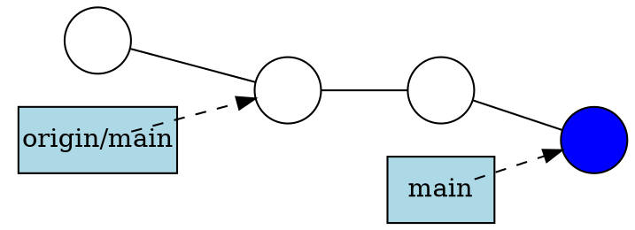
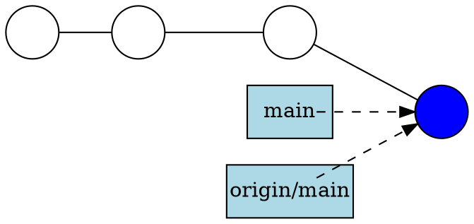
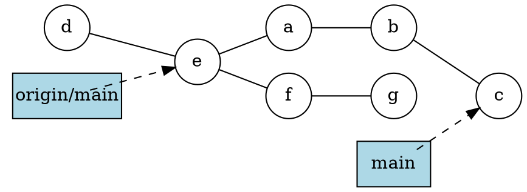
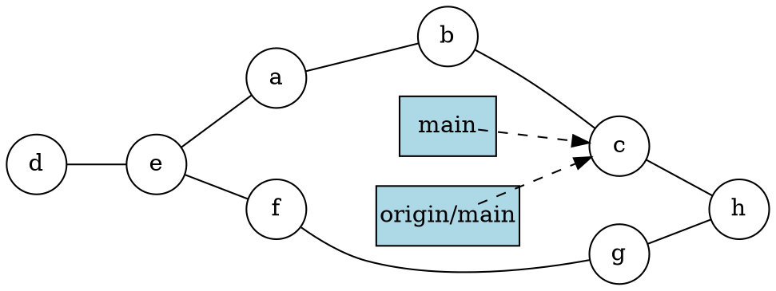

Introduction to Git --- Fall 2022
# Lecture 7: Teamwork

<!-- .slide: data-background="#ffffff" -->

<!-- Lecture material made by Birgitte Brydsö for the version of the course that was given in fall 2020. Lecture was first given by Birgitte Brydsö in fall 2020. Several changes done to the material in 2021 and 2022, mainly due to GitHub no longer allowing for password authentication. -->

    

<small>Slides: https://hackmd.io/@git-fall-2022/L7-teamwork#/</small>

---

## Teamwork

<!-- .slide: style="font-size: 30px;" -->

Git is very useful for teamwork. 
You will often have three types of branches for a project/specific release:

* main (or master) branch
  - exist for the entire project
* development/staging branch
  - developing, preparing new releases 
  - exists for the entire release of the project, then merged to main (master)
* feature branch(es) 
  - created just for the feature development
  - later merged to development/staging branch


NOTE: GitHub previously used "master", but is now using "main" as the name for the first/default branch in a repo

---

## Teamwork

<!-- .slide: style="font-size: 30px;" -->

* In this session you will be working in small groups of 2-4 people. 
* Each group will go to a Zoom break-out room and work together there. 
* You will be using GitHub for the remote repository. 
* Since GitHub no longer allows you to use username and password unless you are working directly on the site, you will set up and use SSH keys. 
* First you will look around GitHub a little and try creating a repository there, as well as creating and editing a file on the site. 
* The rest of the exercises will be about working together on a small project, and will be done from the command line with GitHub as the remote repository. 
* There will be nine exercises in total in this part.

---

## Concepts and commands

<!-- .slide: style="font-size: 28px;" -->

In these exercises we will use only a few commands. These have all been mentioned before in this course, but as a refresher I will briefly discuss a couple commands here, namely: 

- `git fetch`: This is a primary command used to download contents from a remote repository. 
  - example: your teammate has created a new feature branch which they have pushed to the remote repository, but which you do not yet have in your local repository
- `git push`: This is essentially the same as running `git merge main` from inside the remote repository. It is mostly used to upload local changes to a remote repository. 
- `git pull`: This will fetch the latest changes from the current branch from a remote, then apply the changes to your local copy of the branch. It is similar to doing a fetch and a merge.

---

## Git push

<!-- .slide: style="font-size: 30px;" -->

```shell
$ git push  <remote-repo> <branch> 
```

or in some cases just

```shell
$ git push
```

where the default behaviour is pushing to repository "origin" and the same branch as the local. 

---

<!-- .slide: style="font-size: 30px;" -->

Before pushing: 


After pushing: 


---

<!-- .slide: style="font-size: 30px;" -->

Pushing a staged and committed file: 

```shell
bbrydsoe@enterprise-a:~/mytestrepo$ git push origin main
Enter passphrase for key '/home/bbrydsoe/.ssh/id_rsa': 
Enumerating objects: 5, done.
Counting objects: 100% (5/5), done.
Delta compression using up to 4 threads
Compressing objects: 100% (2/2), done.
Writing objects: 100% (3/3), 287 bytes | 287.00 KiB/s, done.
Total 3 (delta 1), reused 0 (delta 0)
remote: Resolving deltas: 100% (1/1), completed with 1 local object.
To github.com:bbrydsoe/mytestrepo.git
   43110f8..5fd2960  main -> main
bbrydsoe@enterprise-a:~/mytestrepo$ git log
commit 5fd2960d91a86f8c581d7470b42b1f3814e24d73 (HEAD -> main, origin/main, origin/HEAD)
Author: Birgitte Brydsö <bbrydsoe@cs.umu.se>
Date:   Sun Nov 13 15:43:05 2022 +0100

    Adding a file
```

---

## Git pull 

<!-- .slide: style="font-size: 30px;" -->

Fetch the given remote's copy of the current branch and merge to the local copy: 
```shell
$ git pull  <remote-repo> 
```

or often just

```shell
$ git pull
```

---

## Hint

<!-- .slide: style="font-size: 30px;" -->

If you have forgotten to pull before staging and committing new stuff, and your colleague has added something to the remote repository in between, this is a handy command: 

```shell
$ git pull --rebase <remote>
```

It fetches the remote content but does not create a new merge commit.

---

<!-- .slide: style="font-size: 30px;" -->

Assume this situation:


Now we do a `git pull`:


---

<!-- .slide: style="font-size: 30px;" -->

## Pull from remote repo, new file

Let us do an example where there is a new file on the remote repository: 

```shell
$ git pull
remote: Enumerating objects: 4, done.
remote: Counting objects: 100% (4/4), done.
remote: Compressing objects: 100% (2/2), done.
Unpacking objects: 100% (3/3), done.
remote: Total 3 (delta 0), reused 0 (delta 0), pack-reused 0
From github.com:bbrydsoe/testrepo
   55f35b9..e6ca68c  main     -> origin/main
Updating 55f35b9..e6ca68c
Fast-forward
 newfile.txt | 1 +
 1 file changed, 1 insertion(+)
 create mode 100644 newfile.txt
```

---

<!-- .slide: style="font-size: 26px;" -->

## Example: creating a new branch, pushing changes

Here we create a new branch on a remote repository and add a file to it, then push: 

Create the branch
```shell
bbrydsoe@enterprise-a:~/mytestrepo$ git branch mynewbranch
bbrydsoe@enterprise-a:~/mytestrepo$
```

Switch to it
```shell
bbrydsoe@enterprise-a:~/mytestrepo$ git checkout mynewbranch
Switched to branch 'mynewbranch'
bbrydsoe@enterprise-a:~/mytestrepo$
```

I then create a file on my new branch. After this, check the status and log

```shell
bbrydsoe@enterprise-a:~/mytestrepo$ git status
On branch mynewbranch
Changes not staged for commit:
  (use "git add <file>..." to update what will be committed)
  (use "git restore <file>..." to discard changes in working directory)
	modified:   myfile.txt

no changes added to commit (use "git add" and/or "git commit -a")
```

---

<!-- .slide: style="font-size: 30px;" -->

## Example continued

```shell
bbrydsoe@enterprise-a:~/mytestrepo$ git log --graph --oneline --decorate --all
* accef46 (HEAD -> mynewbranch, main) Updating the file funny.txt
* 43110f8 (origin/main, origin/HEAD) Update funny.txt
* af9e1cb Create Weird.txt
* db2e945 Create funny.txt
* c74b74c Adding the file file4.txt
* 805d9b3 Create newfile.txt
* c8e5214 Adding some files to play with for the exercise.
* 1c8156d (origin/mytestbranch, mytestbranch) Adding testfile.txt to mytestbranch
*   333d5e5 Merge pull request #2 from bbrydsoe/birgittesbranch
|\  
| * 92901fa (origin/birgittesbranch, birgittesbranch) Adding my new file to my new branch.
* |   e7741d8 Merge pull request #1 from bbrydsoe/spocksbranch
|\ \  
| |/  
|/|   
| * 6814eb4 (origin/spocksbranch) Added a file by user spock
|/  
* d4a666e Adding my new file to the repository.
* 303bf63 Create README.md
bbrydsoe@enterprise-a:~/mytestrepo$
```

Note: when you do this it should be coloured for easier readability

Note: on some newer Git versions, including the current default one on Windows, you can use `git graph` instead of the above long command. 

---

<!-- .slide: style="font-size: 30px;" -->

## Example continued 


I stage and commit the file. 

```shell
bbrydsoe@enterprise-a:~/mytestrepo$ git add myfile.txt 
bbrydsoe@enterprise-a:~/mytestrepo$ git commit -m " Adding a file to my new branch"
[mynewbranch c997da0]  Adding a file to my new branch
 1 file changed, 1 insertion(+)
```

I will check to confirm I am on the right branch: 

```shell
bbrydsoe@enterprise-a:~/mytestrepo$ git branch
  birgittesbranch
  main
* mynewbranch
  mytestbranch
bbrydsoe@enterprise-a:~/mytestrepo$ 
```

---

<!-- .slide: style="font-size: 30px;" -->

## Example continued

Let us again check with `git status` and `git log ...`

```shell
bbrydsoe@enterprise-a:~/mytestrepo$ git status
On branch mynewbranch
nothing to commit, working tree clean
bbrydsoe@enterprise-a:~/mytestrepo$ 
```

```shell
bbrydsoe@enterprise-a:~/mytestrepo$ git log --graph --oneline --decorate --all
* c997da0 (HEAD -> mynewbranch)  Adding a file to my new branch
* accef46 (main) Updating the file funny.txt
* 43110f8 (origin/main, origin/HEAD) Update funny.txt
* af9e1cb Create Weird.txt
* db2e945 Create funny.txt
* c74b74c Adding the file file4.txt
* 805d9b3 Create newfile.txt
* c8e5214 Adding some files to play with for the exercise.
* 1c8156d (origin/mytestbranch, mytestbranch) Adding testfile.txt to mytestbranch
*   333d5e5 Merge pull request #2 from bbrydsoe/birgittesbranch
|\  
| * 92901fa (origin/birgittesbranch, birgittesbranch) Adding my new file to my new branch.
* |   e7741d8 Merge pull request #1 from bbrydsoe/spocksbranch
|\ \  
| |/  
|/|   
| * 6814eb4 (origin/spocksbranch) Added a file by user spock
|/  
* d4a666e Adding my new file to the repository.
* 303bf63 Create README.md
bbrydsoe@enterprise-a:~/mytestrepo$
```

---

<!-- .slide: style="font-size: 28px;" -->

## Example continued 

Push your changes with `git push origin -u yourbranchname` (or with `git push -u origin HEAD`)

```shell
bbrydsoe@enterprise-a:~/mytestrepo$ git push -u origin HEAD
Enter passphrase for key '/home/bbrydsoe/.ssh/id_rsa': 
Enumerating objects: 9, done.
Counting objects: 100% (9/9), done.
Delta compression using up to 4 threads
Compressing objects: 100% (5/5), done.
Writing objects: 100% (6/6), 619 bytes | 619.00 KiB/s, done.
Total 6 (delta 2), reused 0 (delta 0)
remote: Resolving deltas: 100% (2/2), completed with 1 local object.
remote: 
remote: Create a pull request for 'mynewbranch' on GitHub by visiting:
remote:      https://github.com/bbrydsoe/mytestrepo/pull/new/mynewbranch
remote: 
To github.com:bbrydsoe/mytestrepo.git
 * [new branch]      HEAD -> mynewbranch
Branch 'mynewbranch' set up to track remote branch 'mynewbranch' from 'origin'.
bbrydsoe@enterprise-a:~/mytestrepo$ 
```

Let us check the status

```shell
bbrydsoe@enterprise-a:~/mytestrepo$ git status
On branch mynewbranch
Your branch is up-to-date with 'origin/mynewbranch'.

nothing to commit, working tree clean
bbrydsoe@enterprise-a:~/mytestrepo$ 
```

---

<!-- .slide: style="font-size: 30px;" -->

## Example: Merging branches

We will merge the branches from the command line. Let us first see which branches exist in my repo - in this case I will check for both local and remote branches

```shell
bbrydsoe@enterprise-a:~/mytestrepo$ git branch --all
  birgittesbranch
  main
* mynewbranch
  mytestbranch
  remotes/origin/HEAD -> origin/main
  remotes/origin/birgittesbranch
  remotes/origin/main
  remotes/origin/mynewbranch
  remotes/origin/mytestbranch
  remotes/origin/spocksbranch
```

I have a bunch of branches (created previously by me and another user, for testing). As you can see, I am on my newest branch "mynewbranch"

---

<!-- .slide: style="font-size: 30px;" -->

## Example - continued

Switch to the branch we are merging to (main)

```shell
bbrydsoe@enterprise-a:~/mytestrepo$ git checkout main
Switched to branch 'main'
Your branch is up-to-date with 'origin/main'.
bbrydsoe@enterprise-a:~/mytestrepo$ 
```

Do the merge (it will also open an editor where you should write a commit message for why the merge should happen)

```shell
git merge mynewbranch 
Merge made by the 'recursive' strategy.
 myfile.txt | 1 +
 1 file changed, 1 insertion(+)
```

---

<!-- .slide: style="font-size: 27px;" -->

## Example - continued

Let us do a status check

```shell
bbrydsoe@enterprise-a:~/mytestrepo$ git status
On branch main
Your branch is ahead of 'origin/main' by 2 commits.
  (use "git push" to publish your local commits)

nothing to commit, working tree clean
```

Pushing

```shell
bbrydsoe@enterprise-a:~/mytestrepo$ git push
Enter passphrase for key '/home/bbrydsoe/.ssh/id_rsa': 
Enumerating objects: 4, done.
Counting objects: 100% (4/4), done.
Delta compression using up to 4 threads
Compressing objects: 100% (2/2), done.
Writing objects: 100% (2/2), 303 bytes | 303.00 KiB/s, done.
Total 2 (delta 1), reused 0 (delta 0)
remote: Resolving deltas: 100% (1/1), completed with 1 local object.
To github.com:bbrydsoe/mytestrepo.git
   5fd2960..2032676  main -> main
```

Checking status again

```shell
bbrydsoe@enterprise-a:~/mytestrepo$ git status
On branch main
Your branch is up-to-date with 'origin/main'.

nothing to commit, working tree clean
```

---

## First exercise - GitHub (if not setup already)

<!-- .slide: style="font-size: 26px;" -->

1. Create a repository (click on the + at the top right of the menu or picking "Start a new repository" on your "home screen")
2. Under "Quick setup", pick "creating a new file". 
3. Name the file "README.md" (at the top, over the file editor). 
4. Put some text in the file "README.md". 
5. At the bottom, where it says "Commit new file" you should put a useful commit message. Then click "Commit new file"
6. Notice: the content of README.md appears at top level of the repo 
7. Try creating another file in a subdirectory (create subdirectories by adding the name you want after the name of your repo, then adding a "/" and your filename). 
8. Try adding a file that you have created on your computer and uploads (Add file -> Upload files)
9. Test out making edits to your files and committing them - all through the GitHub site. 
10. If you put a file "README.md" in a subdirectory then it will be shown as a "description" for the directory
11. When you have made some commits, try click "commits" above the files in the repo and see a list of your commits. 

---

## Second exercise, SSH keys (if you have not set up already)

<!-- .slide: style="font-size: 26px;" -->

In this exercise you create SSH keys and upload to GitHub. Then test that it works. 

**Create a new SSH key**

1. Open a terminal (Git Bash on Windows). In the command below, "GitHub" is a label added to the key for clarity. You can add any you want: 
    a. Do this
    ```
    $ ssh-keygen -t ed25519 -C "GitHub"
    ```
    b. If you have an older system, this may work better
    ```
    $ ssh-keygen -t rsa -b 4096 -C "GitHub"
    ```
    
2. You will be asked for a file to save the key. Unless you have an existing SSH key, accept the default.
3. Enter a passphrase and repeat it.
4. Add the key to the ssh-agent. Here we assume the default name: 
```
$ eval "$(ssh-agent -s)"

$ ssh-add ~/.ssh/id_rsa
```
5. Switch to the `.ssh` folder, open the file `id_rsa.pub` and copy it. Do NOT add any newlines or whitespace! 

---

<!-- .slide: style="font-size: 28px;" -->

**Adding the SSH key to GitHub**

1. On GitHub, click your avatar in the top right corner and pick "Settings".
2. Choose "SSH and GPG keys"
3. Click "Add new SSH key"
4. Add a descriptive label for the key in the "Title" field. In the key field you paste the content of the key (~/.ssh/id_rsa.pub)

5. Click "Add SSH key"
6. Confirm your GitHub password if you are prompted for it. 

---

<!-- .slide: style="font-size: 28px;" -->

**Testing the SSH keys**

1. Open a terminal
2. `$ ssh -T git@github.com`
3. It will look similar to this: 
```
$ ssh -T git@github.com
The authenticity of host 'github.com (140.82.121.4)' can't be established.
RSA key fingerprint is SHA256:nThbg6kXUpJWGl7E1IGOCspRomTxdCARLviKw6E5SY8.
Are you sure you want to continue connecting (yes/no)? yes
Warning: Permanently added 'github.com,140.82.121.4' (RSA) to the list of known hosts.
Enter passphrase for key '/home/bbrydsoe/.ssh/id_rsa': 
Hi bbrydsoe! You've successfully authenticated, but GitHub does not provide shell access.
```
4. Verify that the resulting message contains your username. 

---

## Third exercise, clone, push, pull

<!-- .slide: style="font-size: 28px;" -->

We now have SSH keys set up. Time to test it from your own machine: 

1. Clone the repository, using the SSH address (click CODE on the GitHub repository and pick SSH). You will be asked for the key passphrase.
2. Enter the local repository. Do a `git pull` and see that it works. You will have to enter the key passphrase. 
3. Create a file (or edit a file). 
4. Add the file. Commit the file (`git add`, `git commit`)
5. Push the file. Again it will ask for the key passphrase. Success! 
6. NOTE: Optionally, you could run `ssh-add` to add the key. Then you will only be asked for the passphrase once per session. This is relatively safe on Linux and macOS, but **not** on Windows where it usually saves the key passphrase permanently.

---

## Fourth exercise, teamwork, clone, push, pull 

<!-- .slide: style="font-size: 25px;" -->

One of you should create a repository on GitHub and invite their team. Remember, on the GitHub webpage the option to create a new repository is in the top right corner - click the "+". To add members: "Settings" -> "Manage access". 

1. Each person should create a file in the repository (Add and commit the file)
2. On the command line, do a `git status`. Do a `git log --graph --oneline --decorate --all`
3. NOTE! To avoid errors, do `git pull` before you stage and commit your file and also the team members should use different names for their files. See the changes appear when you do a `git pull` after all have added their file(s). 
4. You could also try to push a new change before pulling the changes your team members have made. Git will complain, but you should be able to solve this kind of simple problem with `git pull --rebase` before you re-do `git push`
5. Try create more files then add and commit. Do `git status` and `git log --graph --oneline --decorate --all` before and after each step. Push the files to the repository. Check the log and status again. 
6. NOTE: You will be asked for the key passphrase each time you do a push 


---

## Fifth exercise, teamwork, branches and merging 

<!-- .slide: style="font-size: 28px;" -->

1. Each person creates a branch in the repo you created in the previous exercise. You can use `git branch yourbranchname` where you put any name you want for the new branch. 
2. Switch to the new branch with `git checkout yourbranchname`
3. Create a uniquely named file. Put anything you want in it. 
4. Do `git log` and `git status` to see any changes.
5. Stage and commit the file. Check again with `git log` and `git status`
6. Push your changes with `git push origin -u yourbranchname` (or with `git push -u origin HEAD` for a fast way when using the same name)
7. When everyone has done this, all do a `git pull`
8. Use `git status`, `git branch`, and `git log` to see what has happened. 

---

## Sixth exercise, teamwork, branches and merging, pull requests

<!-- .slide: style="font-size: 28px;" -->

1. Go to the repository on the GitHub page. Submit a pull-request from your branch to the main branch
2. The owner of the repository (the person who created it) can then accept them and click to merge them. 
3. After doing so, everyone should again do a `git pull` (on the command line)
4. Use `git status`, `git branch --all`, and `git log --graph --oneline --decorate --all` to see what has happened. 

**Note**: It is possible to make the main branch "protected" so it is not changed without a review from the owner. Try doing this (on GitHub). 

---

## Seventh exercise, teamwork and branches

<!-- .slide: style="font-size: 30px;" -->

1. Everyone in the group create a new branch in the repo - this time you could try doing it from the GitHub page
2. Check which remote branches exist with `git branch -r`
3. Check which local branches you have with `git branch` 
4. Use `git status` to see which branch you are on. 
5. Check with `git branch -a` to see all local and remote branches
6. Do a `git pull` from the command line to get a list of all branches. Switch to the branch you created on GitHub with `git checkout --track origin/mynewbranch`. Again do `git branch` to see which branch you are on. 
7. Create a new file and put some content to it. Add and commit it. Check for changes (`git status`, `git log`). Push the changes.

---

## Seventh exercise, teamwork and branches - continued

<!-- .slide: style="font-size: 30px;" -->

8. Try and merge the branches from the command line. Remember to first pull any changes from your other group members. Also remember to switch to the branch you want to merge it to (main in this case). 
9. Were you succesful? Why or why not? Is there are difference between what happens when the owner of the branch tries this and when everyone else does?
10. After doing this, everyone should again do a `git pull` (on the command line)
11. Use `git status`, `git branch`, and `git log` to see what has happened. If you want a "prettier" and sometimes easier to read view, use `git log --graph --oneline --decorate --all` 

---

## Eighth exercise, deleting branches

<!-- .slide: style="font-size: 30px;" -->

1. Everyone should now create two more branches in the repo. In each case, switch to the branch, create a file in it, and push the branch
2. Check which branches exist, remotely and locally 
3. Try and delete a remote branch with `git push origin --delete myownbranch
4. Try delete a local branch with `git branch -D <alsomyownbranch`>
5. Do a `git status`, `git log` and `git branch` to see what has happened
6. The branch you deleted locally is still on the repo. Get another copy of it (`git pull` and `git fetch`, possibly with suitable flags will get it back for you)

---

## Ninth exercise, merge conflicts

<!-- .slide: style="font-size: 25px;" -->

In this exercise everyone in the team will be working in the same branch, for instance the main branch. 

Merge conflicts generally happen when two (or more) teammembers edit the same file and the same line, or when one edits a file and another deletes it. 

1. Create a new repository on GitHub. Add your team members as in the previous exercises. Everyone clones the repository (from the command line). 
2. Create a couple files. Add, commit, and push. 
   - If more than one creates files, remember to either pull your teammates work first, or do a `git pull --rebase` before pushing. 
4. After doing this, everyone should again do a `git pull`
5. Now one or more make changes to the same file, in the same line. Add, commit, push. 
6. Did you get a conflict? Use `git status`, `git branch`, and `git log` to see what has happened. Try to resolve the conflict. 
7. Now again all will work on one file. One or more edit it and one deletes it (`git rm file`). What happens when you push your work? You should get a conflict. Try and resolve the conflict. Should the file be kept or deleted? 

--- 
