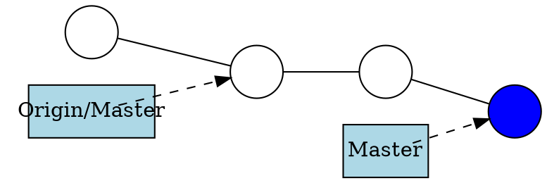
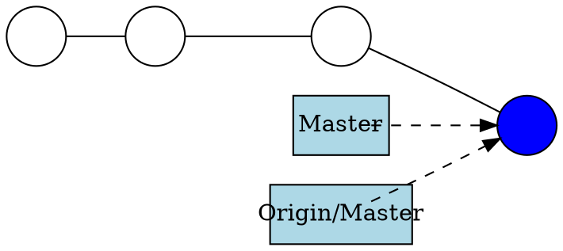
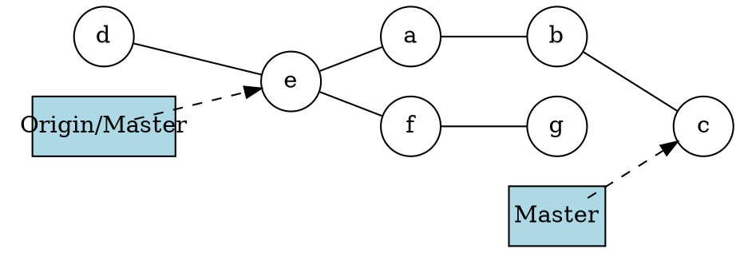
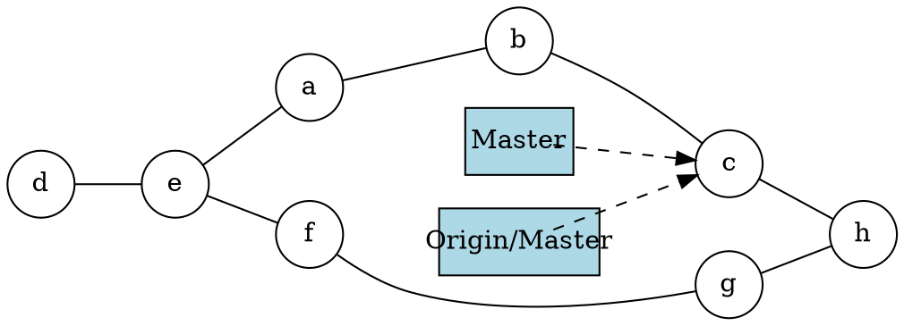

Introduction to Git --- Fall 2021
# Lecture 7: Teamwork

<!-- .slide: data-background="#ffffff" -->

<!-- Lecture material made by Birgitte Brydsö for the version of the course that was given in fall 2020. Lecture was first given by Birgitte Brydsö in fall 2020. -->

    

<small>Slides: https://hackmd.io/@hpc2n-git-2021/L7-teamwork#/</small>

---

## Teamwork

<!-- .slide: style="font-size: 30px;" -->

Git is very useful for teamwork. 
You will often have three types of branches for a project/specific release:

* master branch
  - exist for the entire project
* development/staging branch
  - developing, preparing new releases 
  - exists for the entire release of the project, then merged to master
* feature branch(es) 
  - created just for the feature development
  - later merged to development/staging branch

---

## Teamwork

<!-- .slide: style="font-size: 30px;" -->

* In this session you will be working in small groups of 2-4 people. 
* Each group will go to a Zoom break-out room and work together there. 
* You will be using GitHub for the remote repository. 
* In the first exercise you will be using just your username and password, but in the next exercise you will set up SSH keys. 
* The rest of the exercises will be about working together on a small project. 
* There will be five exercises in total in this part, all which are connected.

---

## Concepts and commands

<!-- .slide: style="font-size: 28px;" -->

In these exercises we will use only a few commands. These have all been mentioned before in this course, but as a refresher I will briefly discuss a couple commands here, namely: 

- `git fetch`: This is a primary command used to download contents from a remote repository. 
  - example: your teammate has created a new feature branch which they have pushed to the remote repository, but which you do not yet have in your local repository
- `git push`: This is essentially the same as running `git merge master` from inside the remote repository. It is mostly used to upload local changes to a remote repository. 
- `git pull`: This will fetch the latest changes from the current branch from a remote, then apply the changes to your local copy of the branch. It is similar to doing a fetch and a merge.

---

## Git push

<!-- .slide: style="font-size: 30px;" -->

```shell
$ git push  <remote-repo> <branch> 
```

or in some cases just

```shell
$ git push
```

where the default behaviour is pushing to repository "origin" and the same branch as the local. 

---

<!-- .slide: style="font-size: 30px;" -->

Before pushing: 


After pushing: 


---

<!-- .slide: style="font-size: 30px;" -->

Pushing a staged and committed file: 

```shell
$ git push origin master
Counting objects: 3, done.
Delta compression using up to 4 threads.
Compressing objects: 100% (2/2), done.
Writing objects: 100% (3/3), 283 bytes | 283.00 KiB/s, done.
Total 3 (delta 0), reused 0 (delta 0)
To github.com:bbrydsoe/testrepo.git
   f91d59b..55f35b9  master -> master
~/teamwork$ git log
commit 55f35b94d5e606af94cbc622f4517109ddb69f21 (HEAD -> master, origin/master)
Author: Birgitte Brydsö <bbrydsoe@cs.umu.se>
Date:   Tue Sep 29 16:40:58 2020 +0200

    Adding a file
```

---

## Git pull 

<!-- .slide: style="font-size: 30px;" -->

Fetch the given remote's copy of the current branch and merge to the local copy: 
```shell
$ git pull  <remote-repo> 
```

or often just

```shell
$ git pull
```

---

## Hint

<!-- .slide: style="font-size: 30px;" -->

If you have forgotten to pull before staging and committing new stuff, and your colleague has added something to the remote repository in between, this is a handy command: 

```shell
$ git pull --rebase <remote>
```

It fetches the remote content but does not create a new merge commit.

---

<!-- .slide: style="font-size: 30px;" -->

Assume this situation:


Now we do a `git pull`:


---

<!-- .slide: style="font-size: 30px;" -->

Let us do an example where there is a new file on the remote repository: 

```shell
$ git pull
remote: Enumerating objects: 4, done.
remote: Counting objects: 100% (4/4), done.
remote: Compressing objects: 100% (2/2), done.
Unpacking objects: 100% (3/3), done.
remote: Total 3 (delta 0), reused 0 (delta 0), pack-reused 0
From github.com:bbrydsoe/testrepo
   55f35b9..e6ca68c  master     -> origin/master
Updating 55f35b9..e6ca68c
Fast-forward
 newfile.txt | 1 +
 1 file changed, 1 insertion(+)
 create mode 100644 newfile.txt
```

---

## First exercise - clone, push, pull

<!-- .slide: style="font-size: 26px;" -->

1. One of you create a repository on GitHub and invite their team. On the GitHub webpage the option to create a new repository is in the top right corner - click the "+". To add members: "Settings" -> "Manage access". 
2. Everyone clones the repository to their local machine, with `git clone`. Use the HTTPS address (click CODE to find it). See example: 

3. Each person then creates a file and adds it to the repository (`git add`, `git commit`, `git push`) 
4. To avoid errors, do `git pull` before you stage and commit your file and use different names for your files. See the changes appear after `git pull`
5. Alternately, you could try to push your new change before pulling the changes your team members have made. Git will complain, but you should be able to solve this kind of simple problem with `git pull --rebase` before you do `git push`
6. You will be using your GitHub username and password for this exercise 

---

## Second exercise, SSH keys

<!-- .slide: style="font-size: 26px;" -->

It is easier to use SSH keys than to enter  username and password every time. In this exercise you create SSH keys and upload to GitHub. Then test that it works. 

**Create a new SSH key**

1. Open a terminal. In the command below, "GitHub" is a label added to the key for clarity. You can add any you want: 
```
$ ssh-keygen -t rsa -b 4096 -C "GitHub"
```
2. You will be asked for a file to save the key. Unless you have an existing SSH key, accept the default.
3. Enter a passphrase and repeat it.
4. Add the key to the ssh-agent. Here we assume the default name: 
```
$ eval "$(ssh-agent -s)"

$ ssh-add ~/.ssh/id_rsa
```
5. Switch to the `.ssh` folder, open the file `id_rsa.pub` and copy it. Do NOT add any newlines or whitespace! 

---

<!-- .slide: style="font-size: 28px;" -->

**Adding the SSH key to GitHub**

1. On GitHub, click your avatar in the top right corner and pick "Settings".
2. Choose "SSH and GPG keys"
3. Click "Add new SSH key"
4. Add a descriptive label for the key in the "Title" field. In the key field you paste the content of the key (~/.ssh/id_rsa.pub)

5. Click "Add SSH key"
6. Confirm your GitHub password if you are prompted for it. 

---

<!-- .slide: style="font-size: 28px;" -->

**Testing the SSH keys**

1. Open a terminal
2. `$ ssh -T git@github.com`
3. It will look similar to this: 
```
$ ssh -T git@github.com
The authenticity of host 'github.com (140.82.121.4)' can't be established.
RSA key fingerprint is SHA256:nThbg6kXUpJWGl7E1IGOCspRomTxdCARLviKw6E5SY8.
Are you sure you want to continue connecting (yes/no)? yes
Warning: Permanently added 'github.com,140.82.121.4' (RSA) to the list of known hosts.
Enter passphrase for key '/home/bbrydsoe/.ssh/id_rsa': 
Hi bbrydsoe! You've successfully authenticated, but GitHub does not provide shell access.
```
4. Verify that the resulting message contains your username. 

---

<!-- .slide: style="font-size: 28px;" -->

We now have SSH keys set up. Try and repeat some of the things that was done in the first exercise: 

1. Again clone the repository, but this time use the SSH address (click CODE on the GitHub repository and pick SSH). You will be asked for the key passphrase.
2. Enter the local repository. Do a `git pull` and see that you no longer have to enter your GitHub username and password, but you do have to enter the key passphrase. 
3. Create a file (or edit a file). 
4. Add the file. Commit the file.
5. Push the file. Again it will not ask for GitHub username and password, but only the key passphrase. Success! 
6. NOTE: Optionally, you could run `ssh-add` to add the key. Then you will only be asked for the passphrase once per session. This is relatively safe on Linux and macOS, but not on Windows where it usually saves the key passphrase permanently.

---

## Third exercise, branches and merging 

<!-- .slide: style="font-size: 30px;" -->

1. Each person creates a branch with `git branch yourbranchname` where you put any name you want for the new branch. 
2. Create a uniquely named file. Put anything you want in it. 
3. Stage and commit the file. 
4. Push your changes with `git push origin -u yourbranchname`
5. When everyone has done this, all do a `git pull`
6. Use `git status`, `git branch`, and `git log` to see what has happened. 

---

## Fourth exercise, branches and merging - continued

<!-- .slide: style="font-size: 30px;" -->

1. Go to the repository on the GitHub page. Submit a pull-request from your branch to the master branch
2. The owner of the repository (the person who created it) can then accept them and click to merge them. 
3. After doing so, everyone should again do a `git pull`
4. Use `git status`, `git branch`, and `git log` to see what has happened.
5. If you want to, you can create more branches and try and merge them from the command line instead. 

It is possible to make the master branch "protected" so it is not changed without a review from the owner. 

---

## Fifth exercise, merge conflicts

<!-- .slide: style="font-size: 30px;" -->

In this exercise everyone in the team will be working in the same branch, for instance the master branch. 

Merge conflicts generally happen when two (or more) teammembers edit the same file and the same line, or when one edits a file and another deletes it. 

1. Create a new repository on GitHub. Add your team members as in the previous exercises. Everyone closes the repository. 
2. Create a couple files. Add, commit, and push. 
   - If more than one creates files, remember to either pull your teammates work first, or do a `git pull --rebase` before pushing. 
4. After doing this, everyone should again do a `git pull`
5. Now one or more make changes to the same file, in the same line. Add, commit, push. 
6. Did you get a conflict? Use `git status`, `git branch`, and `git log` to see what has happened. Try to resolve the conflict. 
7. Now again all will work on one file. One or more edit it and one deletes it (`git rm file`). What happens when you push your work? You should get a conflict. Try and resolve the conflict. Should the file be kept or deleted? 

--- 
